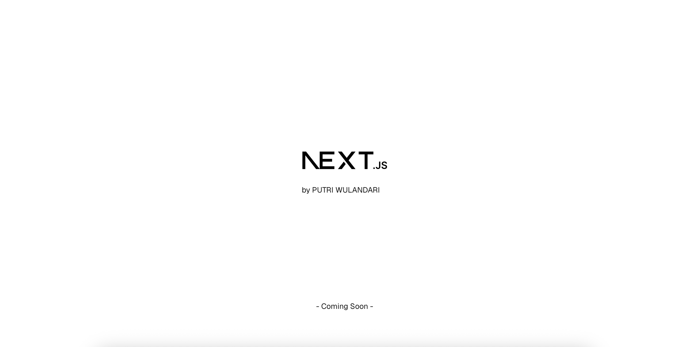

# 🌸 Putri Wulandari - Personal Website



[](https://nextjs.org/)  
[](https://vercel.com/)  
[](#-license)

---

## 📖 Table of Contents
- [About](#-about)
- [Getting Started](#-getting-started)
- [Tech Stack](#-tech-stack)
- [Learn More](#-learn-more)
- [License](#-license)

---

## 🌟 About

**EN:** The website **[putriwulandr.com](https://putriwulandr.com)** contains the biography and portfolio of **Putri Wulandari**. Built using **Next.js (App Router)** for a fast, responsive, and modern web experience.  

**DE:** Die Website **[putriwulandr.com](https://putriwulandr.com)** enthält die Biografie und das Portfolio von **Putri Wulandari**. Erstellt mit **Next.js (App Router)** für eine schnelle, reaktionsschnelle und moderne Web-Erfahrung.

---

## 🚀 Getting Started

### 1. Clone Repository
```bash
git clone https://github.com/username/repo-name.git
cd repo-name
```

### 2. Install Dependencies
Using your preferred package manager:

**npm**
```bash
npm install
npm run dev
```

**yarn**
```bash
yarn install
yarn dev
```

**pnpm**
```bash
pnpm install
pnpm dev
```

**bun**
```bash
bun install
bun dev
```

The app will run at **http://localhost:3000** by default.

---

## 🛠 Tech Stack
- **Framework:** [Next.js (App Router)](https://nextjs.org/)
- **Styling:** Tailwind CSS
- **Deployment:** [Vercel](https://vercel.com/)
- **Language:** TypeScript
- **Package Managers:** npm, yarn, pnpm, bun

---

## 📚 Learn More

- [Next.js Documentation](https://nextjs.org/docs)  
- [Learn Next.js Tutorial](https://nextjs.org/learn)  
- [Deploy on Vercel](https://vercel.com/docs)  

---

## 📄 License

**EN:** This project is created for personal and portfolio purposes.  
**DE:** Dieses Projekt wurde für persönliche Zwecke und als Portfolio erstellt.
